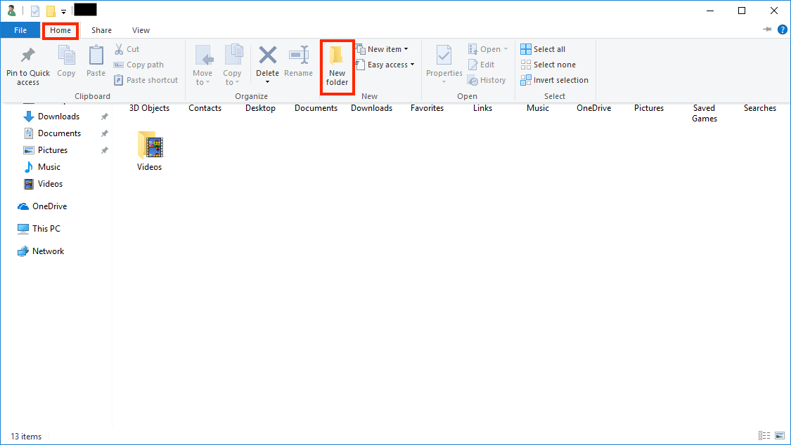
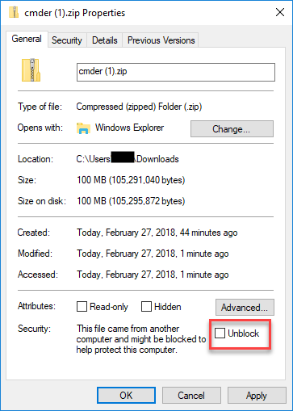
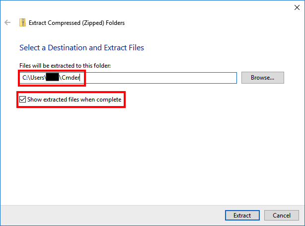

# Cmder {#top}

The default command line tool in Windows is the "Command Prompt". You can find it by going to **Start** <i class="fa fa-long-arrow-right"></i> **Programs** and searching for “Command Prompt”. You can also find it through Windows explorer.

However, the Windows command prompt does not offer much flexibility and functionality, so we will use Cmder.

Cmder wraps different shells (command line interfaces) that makes it versatile. It also includes Git, all packaged together.

## Install Cmder {#install} <a href="#top" title="Take me to the top of page"><i class="fa fa-chevron-circle-up" aria-hidden="true"></i></a>

### Download Cmder {#download} <a href="#install" title="Take me to the top of section"><i class="fa fa-caret-square-o-up" aria-hidden="true"></i></a>
1. Open the Cmder website by navigating to [http://www.cmder.net](http://www.cmder.net).

1. Scroll down to the Download section and click on "Download Full" to download Cmder. This might take a while.

1. While Cmder is downloading, let's get started on creating a folder by opening **File Explorer**.

1. Navigate to your home directory by typing it in your file location bar. It is usually `C:\Users\[Your Login Name]\`.

If you can't find your home directory, type `%USERPROFILE%` in the file location bar and press `Enter`.


1. In the toolbar select **Home** and click on **New Folder**.

   

1. Rename the folder to "Cmder".

### Extract Cmder {#extract} <a href="#install" title="Take me to the top of section"><i class="fa fa-caret-square-o-up" aria-hidden="true"></i></a>
1. When download is complete, open your **Downloads** folder and find "cmder.zip".

1. Right click on the file and select **Properties**. At the bottom of the dialog, if there is an option to **Unblock** the download, check the **Unblock** checkbox.

   
   
Make sure to unblock the download if this checkbox exists. Otherwise, the installation looks successful, but Cmder cannot start up and becomes unusable.
   

1. Right click on the file again and select **Extract All...** and type in the location of your Cmder folder you created. Make sure to check "Show extracted files when complete" and click on **Extract**. When extract is complete, the file explorer will show your Cmder folder.

   

   
Your Cmder folder location should be `C:\Users\[Your Login Name]\Cmder`. If you can't find it, type `%USERPROFILE%\Cmder`.


### Install additional required files {#additional-files} <a href="#install" title="Take me to the top of section"><i class="fa fa-caret-square-o-up" aria-hidden="true"></i></a>
1.  Right click on Cmder application and click on **Run as administrator**. A User Account Control dialog will pop up. Click **Yes**.

1. Cmder will display an warning dialog asking to install extra files. Click **Unblock and Continue**.

   
1. Cmder screen will display and process the required files in the background. When you return to the command prompt, you're done!

### Verify installation {#verify} <a href="#install" title="Take me to the top of section"><i class="fa fa-caret-square-o-up" aria-hidden="true"></i></a>
1. Close the Cmder dialog by typing `exit` and pressing **Enter** or by clicking on the **X** in the upper right corner.

1. Search for "cmder" in your taskbar. Windows should suggest "Cmder.exe Desktop app" as a best match. Right click on it and click on **Run as administrator**. A User Account Control dialog will pop up. Click **Yes**. If your only option after a right click is **Open file location**, select it and then right click on cmder.exe to run as administrator.

   
Always run Cmder as administrator. Doing so will ensure Cmder has file access it needs.


1. Type `git --version`, press `Enter`, and verify the output. You must have git version 2.16.0 or higher.

### Optional- Pin to Start menu {#optional-pin} <a href="#install" title="Take me to the top of section"><i class="fa fa-caret-square-o-up" aria-hidden="true"></i></a>
1. Use the **File Explorer** to open the "Cmder" folder in your home directory. You probably already have this folder open from installation.

1. Right click on Cmder application and select **Pin to Start**.

1. When you start Cmder, right click on the pinned icon, select **More** <i class="fa fa-long-arrow-right"></i> **Run as administrator**.


Cmder helps identify certain things with different symbols and colors. Here are some of the symbols and colors you'll come across.

* Your prompt will look like a lambda \(**λ**\).

* The name of the directory \(folder\) you’re in will displayed in olive-green.

* If you’re in a Git repository, your branch name will display right after the name of the directory you're in.

* If you have uncommitted version control changes made in the repository that you’re in, the branch name will turn red.

* You can edit settings (such as changing color themes or font size) by clicking the hamburger menu on the bottom right of the Cmder window and selecting **Settings...**.


<!-- Trick markdown to give a little extra space -->

## Using Cmder {#using-cmder} <a href="#top" title="Take me to the top of page"><i class="fa fa-chevron-circle-up" aria-hidden="true"></i></a>


<!-- Trick markdown to give a little extra space -->

## Updating Cmder {#update-cmder} <a href="#top" title="Take me to the top of page"><i class="fa fa-chevron-circle-up" aria-hidden="true"></i></a>
Identify if you need to update Cmder by opening your Cmder directory in the file explorer and identifying the version in the _Version v1.x.x_ file. If you have a version less than 1.3.5, you will need to update.

1. Close cmder if you have it open.

1. Follow the first two steps in the instructions to [download Cmder](#download). We already have a "Cmder" folder in our home directory so no need to create a "Cmder" folder.

1. Follow the instructions to [extract Cmder](#extract) files. Windows will ask you if you want to **Replace or Skip Files**. Click **Replace the files in the destination**.  

1. When the files finish copying to the "Cmder" folder, follow the steps in [install additional required files](#additional-files) to allow Cmder to finish installation. You will not see the "Generating click initial settings" in the Cmder terminal when you start the application up. These files already exist from your initial installation.

1. Verify installation by opening your "Cmder" folder and inspect the _Version v1.x.x_ file to ensure you have one greater than 1.3.4. It will keep your previous version file so you should see two.
