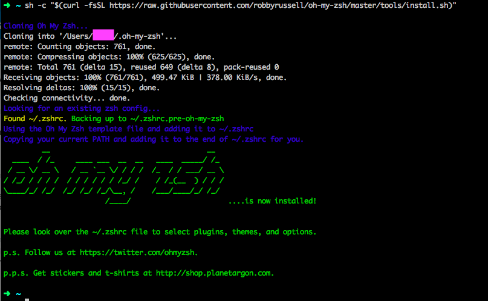

# iTerm2 + oh-my-zsh

The default command line tool on Macs is "Terminal". For a better experience we will be using iTerm2 + oh-my-zsh.


Linux users can skip the iTerm2 instructions and jump straight to oh-my-zsh.


## Download and install iTerm2 {#iterm2}
1. Open the iTerm2 website by navigating to [https://www.iterm2.com](https://www.iterm2.com).

1. Click on "Download" and install.

## Install oh-my-zsh {#oh-my-zsh}
1. Navigate to [https://github.com/robbyrussell/oh-my-zsh\#basic-installation](https://github.com/robbyrussell/oh-my-zsh#basic-installation).

1. Copy all the text under the **via curl** label in the "Basic Installation" section of the GitHub page. Paste into the prompt in iTerm2 and press `Enter`.

1. Enter the password that you use to login to your computer when prompted.

      
It may look like you’re not typing anything, but you are.  It simply doesn't display your password on the screen for security reasons.  Type your full password as you would normally and press `Enter`.
      

1. When the process is complete your screen should look similar to the following \(note the display in ascii art stating "oh my zsh ….is now installed" and you have a nice colorful arrow prompt\):


Oh-my-zsh helps identify certain things with different colors. Here are some of the colors you'll come across.

* The arrow indicating your prompt will be green.

* The name of the directory \(folder\) you’re in displays in aqua.
\(The above picture shows that I’m in my home directory `/users/myusername` indicated by the aqua `~`.  The tilde is a shortcut that references the home directory\).

* If you’re in a Git repository, your branch name will display in a salmon color.

* If you have uncommitted version control changes made in the repository that you’re in, you’ll see a yellow x symbol at the end of your prompt line.

