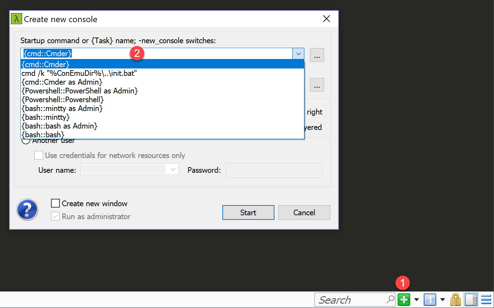
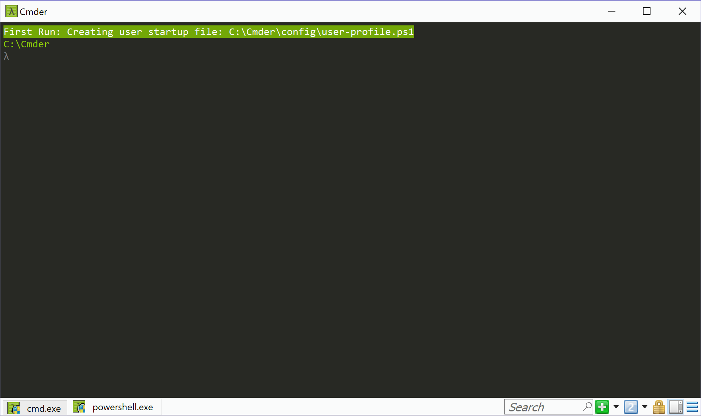

Start Cmder by searching for "cmder" in your taskbar or by selecting Cmder in your Start menu. Right click on Cmder, select **More** <i class="fa fa-long-arrow-right"></i> **Run as administrator**.


Always run Cmder as administrator. Doing so will ensure Cmder has file access it needs.



Cmder helps identify certain things with different symbols and colors. Here are some of the symbols and colors you'll come across.

* Your prompt will look like a lambda \(**λ**\).

* The name of the directory \(folder\) you’re in will displayed in olive-green.

* If you’re in a Git repository, your branch name will display right after the name of the directory you're in.

* If you have uncommitted version control changes made in the repository that you’re in, the branch name will turn red.

* You can edit settings (such as changing color themes or font size) by clicking the hamburger menu on the bottom right of the Cmder window and selecting **Settings...**.


### Other shells
Cmder wraps different shells (command line interfaces) that makes it versatile. It also includes Git, all packaged together.
The standard shell is Windows cmd shell. It also wraps bash and Powershell.

Cmder provides an easy-to-use interface to switch shells if you need to do so.  You can identify which shell you are using by the tab name. The name of the tab matches the shell it's running.

Follow the instructions below to open different shells.
1. Click on green **+** icon to open **Create new console** dialog. See the picture below.
1. Select the shell you want to start from the **Startup command** combobox. Unless otherwise directed, run your shell as **Admin**.

### cmd Shell ({cmd::Cmder})
This is the standard shell. You are using Windows cmd but Cmder adds extra functionality. You can use some Linux operating system functionality in this shell. This is the default shell when you start Cmder and our labs will use this shell.

Open up a cmd shell. Type `exit` and press **Enter** to close the tab.

### bash Shell ({bash::bash as Admin})
This shell best emulates the Linux operating system. It's not an exact match but it's close. You can still use Windows cmd operations in this shell.

Open up a bash shell.  The first time you run bash shell, it will make changes on your machine and create a file for your user profile. The errors shown here should happen this first time, and are normal.  Type `exit` and press **Enter** to close the tab.

### PowerShell Shell ({PowerShell::PowerShell as Admin})
This is the shell that wraps Windows PowerShell. PowerShell is more powerful than Windows cmd shell and has scripting capability built in. PowerShell is most commonly used by System Administrators. You can [read more about PowerShell here](https://docs.microsoft.com/en-us/powershell/scripting/getting-started/getting-started-with-windows-powershell?view=powershell-6).

Open up a PowerShell shell.  The first time you run PowerShell shell, it will make changes on your machine and create a file for your user profile. Type `exit` and press **Enter** to close the tab.

