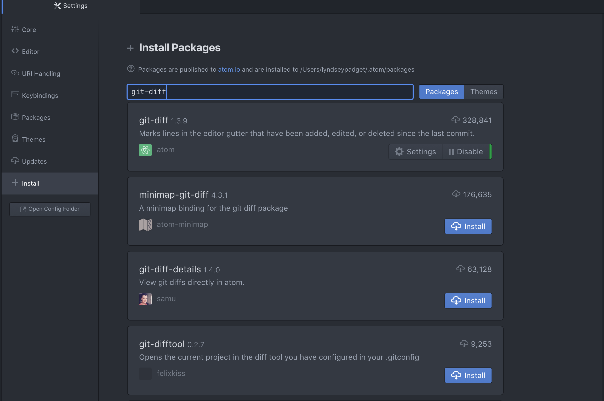
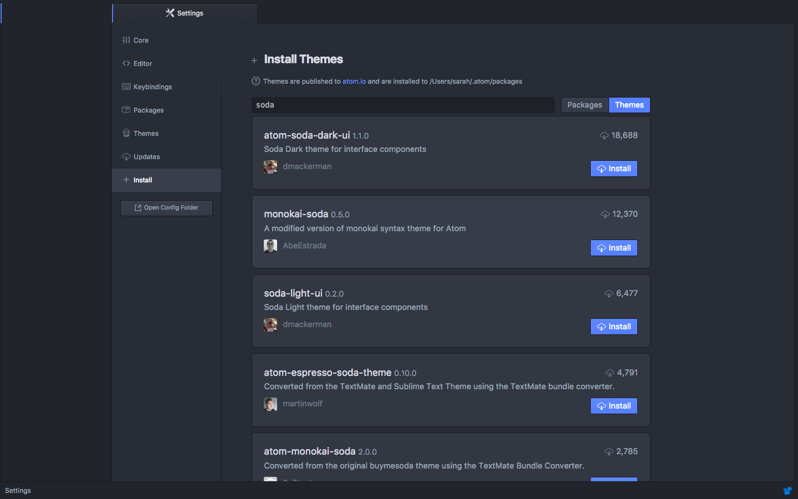
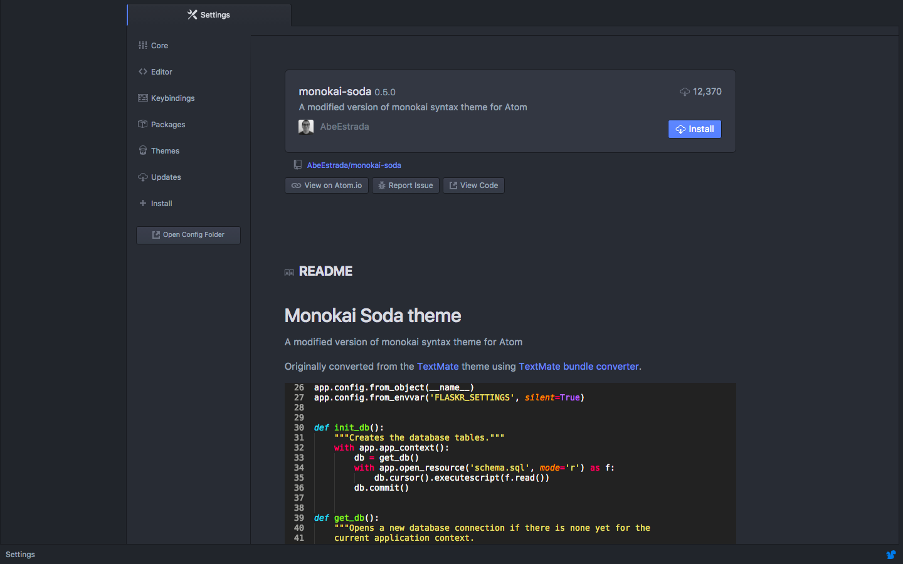

# Text Editor: Atom

You may already be accustomed to using an Integrated Development Environment \(IDE\) such as Visual Studio, Sublime, Eclipse, WebStorm, etc.  Technically, you can use any IDE for the labs, but Atom is the one we'll be using in the instructions. After downloading we will configure it with extra tools called _plugins_ that will make your coding life easier.

The labs will focus more on Git command line than the code, so this is a good opportunity to give Atom a try!  If you don't like it, you can always switch back.

## Download and Install Atom {#download}

1. Open the Atom website by navigating to [https://atom.io](https://atom.io).

1. Download the file then open it and follow the prompts as they appear. Click **Finish** when prompted to complete the installation.

## Configure Atom {#configure}

### Set Atom as Your Git Editor &amp; Diff/Merge tool
By default, Git uses the vi editor to create and edit your commit and tag messages. You can change this to Atom using the following commands.

In addition to the editor used to write commit and tag messages, you should also configure Git to use your preferred editor for "diffing" and merging files.  This will come into play when there are conflicts to resolve or other files you want to compare with one another.

`git config --global core.editor "atom --wait"`

`git config --global merge.tool atom`

`git config --global mergetool.atom.cmd "atom --wait $MERGED"`

`git config --global diff.tool atom`

`git config --global difftool.atom.cmd "atom --wait --diff $LOCAL $REMOTE"`

### Install Required Packages
Next, to get the most out of Atom, we need to install packages. The terms "package" and "plugins" are interchangeable in Atom.  Some plugins are required as part of the labs and some are optional that you can install later if desired.






If you are prompted to install any dependencies select **Yes** to install them.


## (optional) Tips for using Atom {#tips}

### Uninstall a Package
 * To uninstall a package open the settings like we did above.  Choose **Packages** from the settings menu and search for the package you’d like to uninstall.  Click on the **Uninstall** button.

### Splitting the Screen
 * Open the **View** menu, choose the **Panes** option then choose how you want to split your screen.

### Keyboard Shortcuts


## (optional) Customize Atom {#customize}
There are optional plugins and themes you can install to help customize your IDE and make it your own.

### Additional Plugins
* **Atom Beautify** - beautify your code.  This means it will add indentations for you to make your code better organized and easier to read.

  Search for "atom-beautify" and click the **Install** button

* **Color Picker** – select colors from within your code

  Search for "color-picker" and click the **Install** button

* **File Icons** - display colorful icons in your project folder display to quickly identify file types

  Search for "file-icons" and click the **Install** button

### Themes
Make it look pretty with themes.

Follow the instructions in the [Required Packages section](#required-packages) to open the **Settings** tab. Click on the **Themes** button next to the search area to search for themes instead of packages.  
  

  Some popular themes include:

  * Soda

  * Dracula

  * Seti

  * Monokai

  _Hint: click on the individual theme sections in the search results to view an example of the theme colors_  
  
