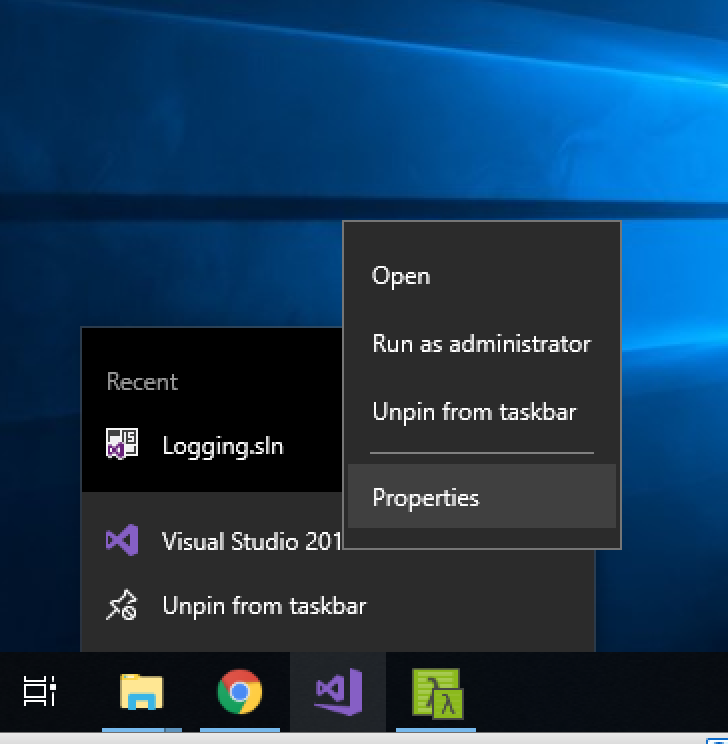
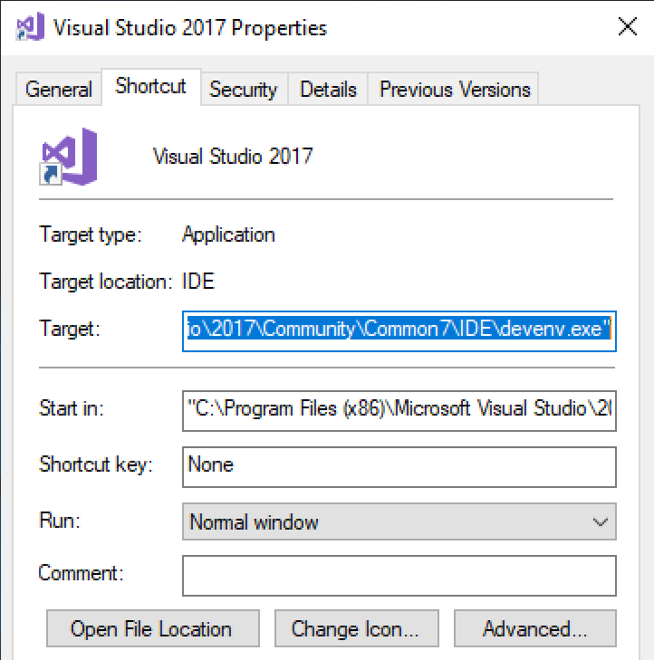
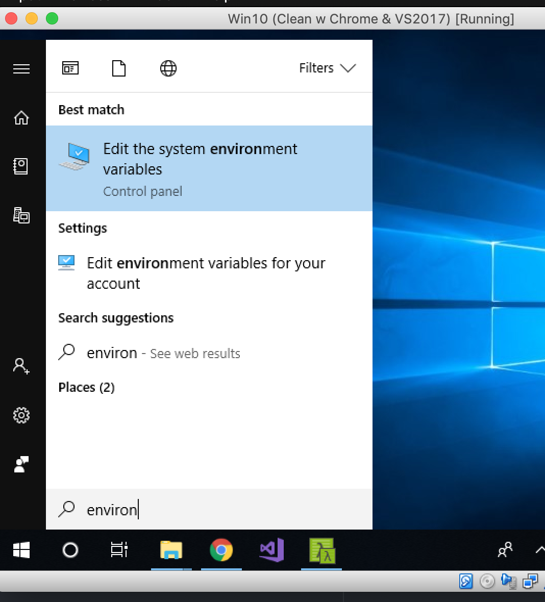

# Text Editors, Git, and You

By default, Git uses whatever you’ve set as your default text editor via one of the shell environment variables VISUAL or EDITOR, or else falls back to the vi editor to create and edit your commit and tag messages. To change this default to something else, you can use one of the following commands, depending on your editor of choice.

In addition to the editor used to write commit and tag messages, you should also configure Git to use your preferred editor for "diffing" and merging files.  This will come into play when there are conflicts to resolve or other files you want to compare with one another.

If you are new to development and don't yet have a favorite editor or IDE (integrated development environment), there are instructions on how to install and use Atom.  The labs use this editor, but it's optional.

Whichever editor you choose, the command (i.e. "atom" or "code") must be accessible from the command line.  If that's not the case, follow the instructions at the bottom to get the command onto your PATH.

# Configurations for different editors

##Atom
`git config --global core.editor "atom --wait"`

`git config --global merge.tool atom`

`git config --global mergetool.atom.cmd "atom --wait $MERGED"`

`git config --global diff.tool atom`

`git config --global difftool.atom.cmd "atom --wait --diff $LOCAL $REMOTE"`

##emacs
`git config --global core.editor "emacs"`

`git config --global merge.tool emacs`

`git config --global mergetool.emacs.cmd "emacs --wait $MERGED"`

`git config --global diff.tool emacs`

`git config --global difftool.emacs.cmd "emacs --wait --diff $LOCAL $REMOTE"`

##nano
`git config --global core.editor "nano -w"`

`git config --global merge.tool nano`

`git config --global mergetool.nano.cmd "nano --wait $MERGED"`

`git config --global diff.tool nano`

`git config --global difftool.nano.cmd "nano --wait --diff $LOCAL $REMOTE"`

##vim
`git config --global core.editor "vim"`

`git config --global merge.tool vim`

`git config --global mergetool.vim.cmd "vim --wait $MERGED"`

`git config --global diff.tool vim`

`git config --global difftool.vim.cmd "vim --wait --diff $LOCAL $REMOTE"`

##Sublime Text (Mac)
`git config --global core.editor "subl -n -w"`

`git config --global merge.tool subl`

`git config --global mergetool.subl.cmd "subl --wait $MERGED"`

`git config --global diff.tool subl`

`git config --global difftool.subl.cmd "subl --wait --diff $LOCAL $REMOTE"`

##Sublime Text (Win, 32-bit install)
`git config --global core.editor "'c:/program files (x86)/sublime text 3/sublimetext.exe' -w"`

`git config --global merge.tool subl`

`git config --global mergetool.subl.cmd "'c:/program files (x86)/sublime text 3/sublimetext.exe --wait $MERGED"`

`git config --global diff.tool subl`

`git config --global difftool.subl.cmd "'c:/program files (x86)/sublime text 3/sublimetext.exe --wait --diff $LOCAL $REMOTE"`

##Sublime Text (Win, 64-bit install)
`git config --global core.editor "'c:/program files/sublime text 3/sublimetext.exe' -w"`

`git config --global merge.tool subl`

`git config --global mergetool.subl.cmd "'c:/program files/sublime text 3/sublimetext.exe' --wait $MERGED"`

`git config --global diff.tool subl`

`git config --global difftool.subl.cmd "'c:/program files/sublime text 3/sublimetext.exe' --wait --diff $LOCAL $REMOTE"`

##Textmate
`git config --global core.editor "mate -w"`

`git config --global merge.tool mate`

`git config --global mergetool.mate.cmd "mate --wait $MERGED"`

`git config --global diff.tool mate`

`git config --global difftool.mate.cmd "mate --wait --diff $LOCAL $REMOTE"`

##Visual Studio Code
`git config --global core.editor "code --wait"`

`git config --global merge.tool vscode`

`git config --global mergetool.vscode.cmd "code --wait $MERGED"`

`git config --global diff.tool vscode`

`git config --global difftool.vscode.cmd "code --wait --diff $LOCAL $REMOTE"`

# Setting up the editor on your PATH

## Windows

Right-click on your editor and choose **Properties**.

Copy the value from the Target field.  Click cancel (we don't need to make changes here.)

Hit the Windows key and type in "environ".  You should see an option to "Edit the system environment variables".  Choose this one.

On the Advanced tab, click "Environment Variables..." at the bottom.
