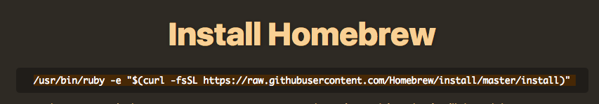
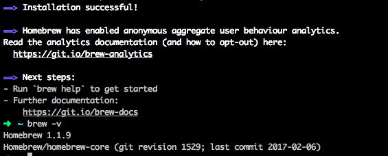

# Git / GitHub
[**Git**](https://git-scm.org) is version control software, and [**GitHub**](https://github.com) is a cloud-based, proprietary PAAS (platform as a service) for Git.  More succinctly, GitHub is a web site that helps people store and share code.  This is where the repositories you create in the labs will be hosted.

## Create a Github account
If you already have a GitHub account, you can skip to the next section.

1. In your browser, [sign up for a GitHub account](https://github.com/join?source=header-home) by entering a username, email address, and password.
1. In Step 2: Choose your plan, select **Unlimited public repositories for free** and click **Continue**.
1. Fill out the survey or skip Step 3.

## Install Git
Follow the appropriate section below based on your operating system.

### Windows

If you installed Cmder, you already have Git! Give yourself a high-five!

Now all you have to do is configure some Git settings.

In this section we will:
1. Set your name in Git
1. Set your email in Git

1. Open Cmder by searching for "cmder" in the task bar or by selecting the pin in your **Start** menu.

1. At the prompt set your user name by running the command `git config --global user.name "Your Name"` replacing the text `Your Name` with your own full name, keeping the quotation marks.

1. Next, set your user email address by running the command `git config --global user.email youremail@example.com` replacing `youremail@example.com` with your own email address.

1. Take a moment to verify your git version by typing `git --version` in Cmder. You must have git version 2.16.0 or higher for lab work.

### Mac/Linux

1. Install Homebrew - a package manager to install and manage development software you'll use.

      1. In Google Chrome, navigate to [http://brew.sh](http://brew.sh)

      2. Copy the text underneath the "Install Homebrew" header.

      

      3. In iTerm2 paste the text copied from the Homebrew website at the arrow command prompt and press **Enter**.

            1. If you are prompted to install Command Line Developer Tools select the **Install** button and accept the license agreement.

            

            2. At the prompt "Press RETURN to continue or any other key to abort" press Return/Enter.

            3. When prompted, type in the password that you use to login to your computer.

            
It may look like you’re not typing anything, but you are.  It simply doesn't display your password on the screen for security reasons.  Type your full password as you would normally and press `Enter`.
            

            4. The process will run for a few minutes until it completes.  When finished type `brew -v`.  This should display the version number of Homebrew that you have installed. Your screen should look similar to the following:

            

2. Install Git

      1. In iTerm2, type `brew install git` and press enter.

      2. When the process completes, type `git --version` at the arrow prompt to ensure Git was properly installed.  If it is properly installed you should see something like `git version 2.8.3` returned.

      3. Now we need to configure our Git version control so that you can use it with GitHub later

            1. At the prompt (the green arrow) set your user name by running the command `git config --global user.name "Your Name"` replacing the text `Your Name` with your own full name, keeping the quotation marks.

            2. Next, set your user email address by running the command `git config --global user.email youremail@example.com` replacing `youremail@example.com` with your own email address.
